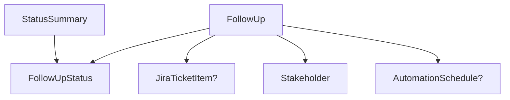

# 📦 Models — Panduan Tim

Dokumentasi seluruh model data yang digunakan di **FollupApp**.

> [!IMPORTANT]
> Semua model bersifat **shared** — satu model bisa dipakai di banyak view. **Jangan** membuat model per-view (contoh: ~~`SummaryCardItem`~~, ~~`JobRowCardModel`~~). Gunakan model yang sudah ada.

---

## 📁 Daftar File

| File | Model | Deskripsi |
|------|-------|-----------|
| `FollowUpModel.swift` | `FollowUp` | Model utama follow-up email |
| `FollowUpStatusModel.swift` | `FollowUpStatus` | Enum status follow-up (ongoing/replied/expired) |
| `JiraTicketModel.swift` | `JiraTicketItem` | Data tiket Jira yang terhubung |
| `StakeholderModel.swift` | `Stakeholder` | Info penerima/stakeholder |
| `StatusSummaryModel.swift` | `StatusSummary` | Ringkasan jumlah per status (untuk dashboard) |
| `AutomationScheduleModel.swift` | `AutomationSchedule` | Jadwal otomasi pengiriman email |

---

## 🏗️ Relasi Antar Model



`FollowUp` adalah **model utama** yang menghubungkan semua model lainnya.

---

## 📋 Detail Setiap Model

### 1. `FollowUp` — Model Utama

> File: `FollowUpModel.swift`

Menyimpan seluruh data satu item follow-up, termasuk email, jadwal, dan tiket terkait.

| Property | Tipe | Wajib | Contoh |
|----------|------|-------|--------|
| `id` | `UUID` | ✅ | `UUID()` |
| `title` | `String` | ✅ | `"Azure Migration Follow-Ups"` |
| `status` | `FollowUpStatus` | ✅ | `.ongoing` |
| `linkedTicket` | `JiraTicketItem?` | ❌ | `JiraTicketItem(ticketKey: "ADA-001", ...)` |
| `stakeholder` | `Stakeholder` | ✅ | `Stakeholder(name: "Ujang", ...)` |
| `lastFollowUpDate` | `Date` | ✅ | `10 May 2026` |
| `nextFollowUpDate` | `Date` | ✅ | `15 May 2026` |
| `schedule` | `AutomationSchedule?` | ❌ | `AutomationSchedule(frequency: 2, ...)` |
| `emailSubject` | `String` | ✅ | `"Azure Migration Follow-Up"` |
| `emailBody` | `String` | ✅ | `"Dear Pak Bom, Gimana ya pak?"` |

**Contoh penggunaan:**
```swift
let followUp = FollowUp(
    id: UUID(),
    title: "Azure Migration Follow-Ups",
    status: .ongoing,
    linkedTicket: JiraTicketItem(ticketKey: "ADA-001", title: "Azure Migration", iconName: "circle.circle.fill"),
    stakeholder: Stakeholder(id: UUID(), name: "Ujang Pintu", email: "ujang@mail.com"),
    lastFollowUpDate: Date(),
    nextFollowUpDate: Calendar.current.date(byAdding: .day, value: 3, to: Date())!,
    emailSubject: "Azure Migration Follow-Up",
    emailBody: "Dear Pak Bom, Gimana ya pak?"
)
```

**Dipakai di:** `JobRowCardView`, `DashboardView`

---

### 2. `FollowUpStatus` — Enum Status

> File: `FollowUpStatusModel.swift`

Enum dengan 3 status follow-up. Sudah include `color` dan `iconName` untuk UI.

| Case | Raw Value | Color | Icon |
|------|-----------|-------|------|
| `.ongoing` | `"ONGOING"` | `themeAccent` (oranye) | `hourglass` |
| `.replied` | `"REPLIED"` | `themeSecondary` (hijau) | `checkmark` |
| `.expired` | `"EXPIRED"` | `themeGray2` (abu) | `trash.fill` |

**Computed properties:**
- `color: Color` — Warna untuk badge dan summary card
- `iconName: String` — SF Symbol icon name

**Conform to:** `String`, `CaseIterable`, `Codable`

**Contoh penggunaan:**
```swift
// Ambil semua status
FollowUpStatus.allCases // [.ongoing, .replied, .expired]

// Akses color & icon
let status: FollowUpStatus = .replied
status.color     // Color.themeSecondary
status.iconName  // "checkmark"
status.rawValue  // "REPLIED"
```

**Dipakai di:** `FollowUp`, `StatusSummary`, `BadgeStatusCardView`, `SummaryCardView`

---

### 3. `JiraTicketItem` — Tiket Jira

> File: `JiraTicketModel.swift`

Data tiket Jira. Dipakai sebagai linked ticket di `FollowUp` dan ditampilkan di `JiraTicketRowView`.

| Property | Tipe | Contoh |
|----------|------|--------|
| `id` | `UUID` (auto) | — |
| `ticketKey` | `String` | `"ADA-001"` |
| `title` | `String` | `"Azure Migration"` |
| `iconName` | `String` | `"circle.circle.fill"` |

**Contoh penggunaan:**
```swift
let ticket = JiraTicketItem(
    ticketKey: "ADA-001",
    title: "Azure Migration",
    iconName: "circle.circle.fill"
)
```

**Dipakai di:** `FollowUp.linkedTicket`, `JiraTicketRowView`, `DashboardView`

---

### 4. `Stakeholder` — Penerima Email

> File: `StakeholderModel.swift`

Info stakeholder / penerima follow-up email.

| Property | Tipe | Contoh |
|----------|------|--------|
| `id` | `UUID` | `UUID()` |
| `name` | `String` | `"Ujang Pintu"` |
| `email` | `String` | `"ujang@mail.com"` |

**Conform to:** `Identifiable`, `Codable`

**Dipakai di:** `FollowUp.stakeholder`

---

### 5. `StatusSummary` — Ringkasan Dashboard

> File: `StatusSummaryModel.swift`

Menyimpan jumlah follow-up per status. Dipakai khusus untuk **summary card** di dashboard.

| Property | Tipe | Contoh |
|----------|------|--------|
| `id` | `UUID` (auto) | — |
| `status` | `FollowUpStatus` | `.replied` |
| `count` | `Int` | `9` |

> [!TIP]
> Title, icon, dan color **tidak perlu disimpan** di `StatusSummary` — semua sudah tersedia di `FollowUpStatus` via `status.color`, `status.iconName`, dan `status.rawValue.capitalized`.

**Contoh penggunaan:**
```swift
let summaries = [
    StatusSummary(status: .replied, count: 9),
    StatusSummary(status: .ongoing, count: 12),
    StatusSummary(status: .expired, count: 3)
]
```

**Dipakai di:** `SummaryCardView`, `DashboardView`

---

### 6. `AutomationSchedule` — Jadwal Otomasi

> File: `AutomationScheduleModel.swift`

Konfigurasi jadwal otomatis pengiriman follow-up email.

| Property | Tipe | Contoh |
|----------|------|--------|
| `startDate` | `Date` | `7 March 2026` |
| `expiryDate` | `Date` | `9 March 2026` |
| `frequency` | `Int` | `2` (kali) |
| `repeatInterval` | `String` | `"Daily"` |
| `requiresConfirmation` | `Bool` | `true` |

**Conform to:** `Codable`

**Dipakai di:** `FollowUp.schedule` (opsional)

---

## 🗺️ Model → View Mapping

| Model | View yang menggunakan |
|-------|----------------------|
| `FollowUp` | `JobRowCardView`, `DashboardView` |
| `FollowUpStatus` | `BadgeStatusCardView`, `SummaryCardView`, `JobRowCardView` |
| `JiraTicketItem` | `JiraTicketRowView`, `DashboardView`, `JobRowCardView` (via `FollowUp`) |
| `Stakeholder` | _(belum ada dedicated view)_ |
| `StatusSummary` | `SummaryCardView`, `DashboardView` |
| `AutomationSchedule` | _(belum ada dedicated view)_ |

---

## ⚠️ Aturan Penting

1. **Jangan buat model per-view** — Gunakan model yang sudah ada. Jika butuh data tambahan, tambahkan property ke model yang relevan.

2. **Computed properties di enum** — Untuk data yang bisa diturunkan dari status (color, icon), taruh di `FollowUpStatus` sebagai computed property, bukan di model baru.

3. **Optional vs Required** — Property yang opsional (seperti `linkedTicket`, `schedule`) ditandai dengan `?`. Jangan force-unwrap di view.

4. **Naming convention:**
   - File: `[NamaModel]Model.swift`
   - Struct: PascalCase (`FollowUp`, `JiraTicketItem`)
   - Property: camelCase (`ticketKey`, `lastFollowUpDate`)

5. **Protokol:**
   - Semua model yang tampil di `ForEach` harus conform `Identifiable`
   - Model yang akan di-encode/decode harus conform `Codable`
