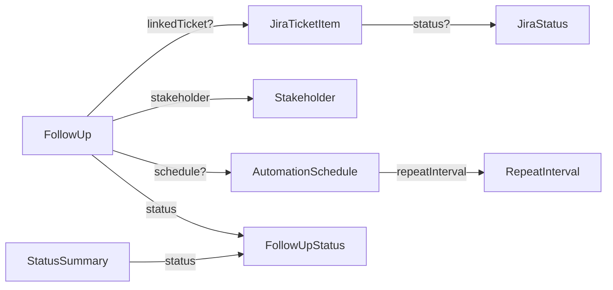
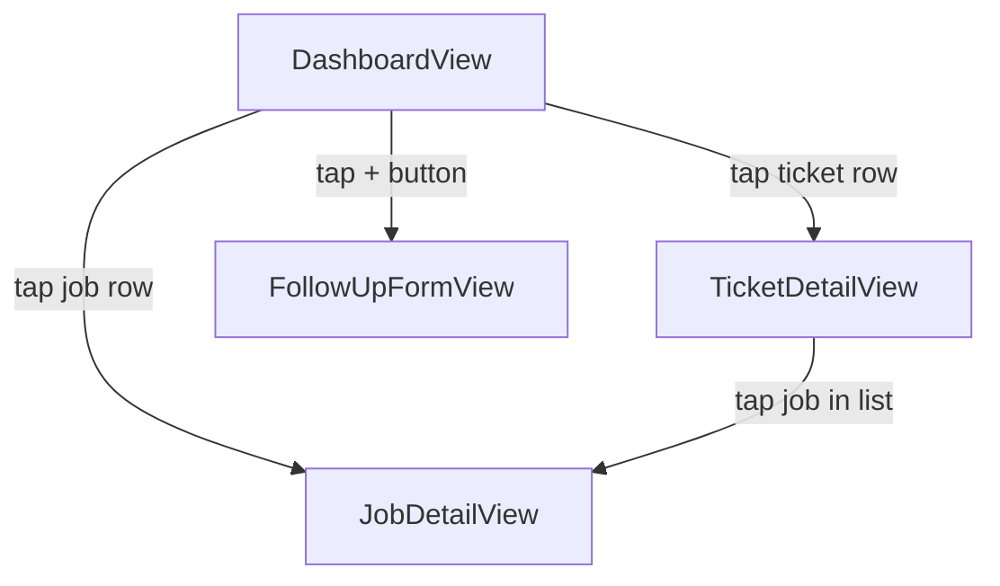

# Follup App

> **Automated Follow-Up Tracker** — An iOS app to manage, schedule, and track email follow-ups linked to Jira tickets.

Built with **SwiftUI** and **MVVM architecture** using the `@Observable` macro (iOS 17+).

---

## Architecture

The project follows strict **MVVM (Model-View-ViewModel)** with these rules:

| Principle | Implementation |
|-----------|---------------|
| **Separation of Concerns** | Views are purely declarative — no business logic, no API calls, no data transformations |
| **Observable Pattern** | All ViewModels use `@Observable` macro |
| **State Management** | ViewModels are initialized with `@State` in Views to prevent re-creation during view updates |
| **Type Safety** | Enums (`FollowUpStatus`, `JiraStatus`, `RepeatInterval`) used instead of magic numbers or raw strings |
| **Stateless Components** | Reusable UI components (Cards, Badges) receive data via parameters — no internal state |

### Navigation

Navigation uses the **value-based** pattern:
- `NavigationLink(value:)` in child components emits data
- `.navigationDestination(for:)` in the parent `DashboardView` handles routing
- Child components never reference destination views (decoupled)

---

## Project Structure

```
FollupApp/
├── FollupApp.swift                  # App entry point
│
├── Models/
│   ├── Enum/
│   │   ├── FollowUpStatusModel.swift    # FollowUpStatus (.ongoing, .replied, .expired)
│   │   ├── JiraStatusLabelModel.swift   # JiraStatus (.inprogress, .todo, .done, .unknown)
│   │   └── RepeatIntervalModel.swift    # RepeatInterval (.daily, .every2Days, .weekly, etc.)
│   ├── FollowUpModel.swift              # FollowUp — core data model
│   ├── JiraTicketModel.swift            # JiraTicketItem — Jira ticket reference
│   ├── StakeholderModel.swift           # Stakeholder — contact info
│   ├── AutomationScheduleModel.swift    # AutomationSchedule — scheduling config
│   └── StatusSummaryModel.swift         # StatusSummary — aggregated count per status
│
├── ViewModels/
│   ├── DashboardViewModel.swift         # Orchestrates dashboard data + navigation helpers
│   ├── JobViewModel.swift               # Manages job list display (truncation, pagination)
│   ├── JiraTicketViewModel.swift        # Manages ticket list display
│   ├── TicketViewModel.swift            # Ticket detail: filtering, search, summary counts
│   ├── JobDetailViewModel.swift         # Job detail: formatted fields for display
│   └── FollowUpFormViewModel.swift      # Form state + FollowUp creation
│
├── Views/
│   ├── DashboardView.swift              # Main screen — summary, jobs, tickets
│   ├── JobDetailView.swift              # Job detail screen (pushed destination)
│   ├── TicketDetailView.swift           # Ticket detail with job list + filters (pushed destination)
│   ├── FollowUpFormView.swift           # Create new follow-up form
│   └── Components/
│       ├── SummaryCardView.swift        # Dashboard summary badges (colored cards)
│       ├── SummaryListJobCardView.swift # Ticket detail summary (icon + count layout)
│       ├── JobRowCardView.swift         # Job list card with NavigationLink
│       ├── JiraTicketRowView.swift      # Ticket list card with NavigationLink
│       ├── JiraCardView.swift           # Jira ticket card (kanban style)
│       ├── BadgeStatusCardView.swift    # Status badge pill (stateless)
│       ├── JiraStatusLabelView.swift    # Jira status label pill (stateless)
│       ├── EmailCardView.swift          # Email form fields (stateless, @Binding)
│       └── ScheduleCardView.swift       # Schedule form fields (stateless, @Binding)
│
└── Extensions/
    ├── ColorTheme.swift                 # Color palette (themePrimary, themeSecondary, etc.)
    ├── FollowUpStatusUI.swift           # FollowUpStatus → color, iconName
    ├── JiraStatusUI.swift               # JiraStatus → color
    ├── FollowUp+Display.swift           # Shared display helpers (dateInfoText, ticketInfoText)
    └── MockData.swift                   # Sample data for development/simulator (DEBUG only)
```

---

## Data Models

### Core Models

```
┌─────────────────────────────────────────────────────────┐
│ FollowUp                                                │
├─────────────────────────────────────────────────────────┤
│ id: UUID                                                │
│ title: String                                           │
│ status: FollowUpStatus          → .ongoing / .replied / .expired
│ linkedTicket: JiraTicketItem?   → optional Jira link    │
│ stakeholder: Stakeholder        → contact person        │
│ lastFollowUpDate: Date                                  │
│ nextFollowUpDate: Date                                  │
│ schedule: AutomationSchedule?   → optional automation   │
│ emailSubject: String                                    │
│ emailBody: String                                       │
└─────────────────────────────────────────────────────────┘

┌───────────────────────────────┐  ┌───────────────────────────────┐
│ JiraTicketItem                │  │ Stakeholder                   │
├───────────────────────────────┤  ├───────────────────────────────┤
│ id: String                    │  │ id: UUID                      │
│ ticketKey: String  ("ADA-001")│  │ name: String                  │
│ title: String                 │  │ email: String                 │
│ iconName: String              │  └───────────────────────────────┘
│ status: JiraStatus?           │
└───────────────────────────────┘

┌───────────────────────────────┐  ┌───────────────────────────────┐
│ AutomationSchedule            │  │ StatusSummary                 │
├───────────────────────────────┤  ├───────────────────────────────┤
│ startDate: Date               │  │ id: UUID                      │
│ expiryDate: Date              │  │ status: FollowUpStatus        │
│ frequency: Int                │  │ count: Int                    │
│ repeatInterval: RepeatInterval│  └───────────────────────────────┘
│ requiresConfirmation: Bool    │
└───────────────────────────────┘
```

### Enums

| Enum | Raw Type | Cases |
|------|----------|-------|
| `FollowUpStatus` | `String` | `ongoing`, `replied`, `expired` |
| `JiraStatus` | `String` | `inprogress`, `todo`, `done`, `unknown` |
| `RepeatInterval` | `String` | `daily`, `every2Days`, `every3Days`, `weekly`, `biweekly` |

### Model Relationships



---

## Screen Flow



---

## View ↔ ViewModel Mapping

| View | ViewModel | Ownership |
|------|-----------|-----------|
| `DashboardView` | `DashboardViewModel` | `@State` (owns `JobViewModel` + `JiraTicketViewModel`) |
| `JobDetailView` | `JobDetailViewModel` | `@State` (received via navigation) |
| `TicketDetailView` | `TicketViewModel` | `@State` (created by `DashboardViewModel.ticketDetailVM(for:)`) |
| `FollowUpFormView` | `FollowUpFormViewModel` | `@State` |

---

## Mock Data

Mock data is loaded automatically in **DEBUG builds** via `DashboardViewModel.init()`:

```swift
init() {
    #if DEBUG
    MockData.populateDashboard(self)
    #endif
}
```

Includes **7 follow-up jobs** (3 ongoing, 2 replied, 2 expired), **5 Jira tickets**, and **5 stakeholders**.

---

## Tech Stack

- **Language**: Swift 6
- **UI Framework**: SwiftUI
- **Minimum Target**: iOS 17+
- **Architecture**: MVVM with `@Observable`
- **Navigation**: Value-based `NavigationStack` + `navigationDestination(for:)`

---

## Team

Built by **ATM UCAK** team at Apple Developer Academy.
